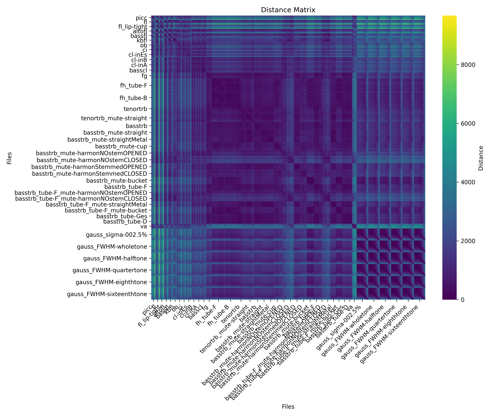

Language: [English](../README.md) | [日本語](README.ja.md) | [Français](README.fr.md) | Deutsch

> **Klangfarbenmelodien!** Welche feinen Sinne, die hier unterscheiden, welcher hochentwickelte Geist, der an so subtilen Dingen Vergnügen finden mag!
>
> Wer wagt hier Theorie zu fordern!
>
> — A. Schönberg, *Harmonielehre* (1911)

Der Komponist **Arnold Schönberg** schrieb diese Worte am Ende seiner *Harmonielehre* (1911), die er im Gedenken an seinen Lehrer und engen Freund, den Komponisten und Dirigenten **Gustav Mahler**, veröffentlichte.

Dieser Herausforderung stellten sich später **Alban Berg**, **Anton Webern** sowie nach dem Zweiten Weltkrieg **Luigi Nono**, **Pierre Boulez** und **Karlheinz Stockhausen**. Keinem von ihnen gelang es jedoch, eine angemessene Methode zu entwickeln. Sie – und die Musik selbst – waren der Wissenschaftsgeschichte ihrer Zeit voraus.

Im 21. Jahrhundert ermöglicht die **Informationsgeometrie** von **Shun-ichi Amari** (1982/85–), den **Abstand zwischen Klangfarben** als exakte physikalische Größe in **Hz** zu messen. Daraus werden Klangfarben-Geodäten, eine Geometrie von Akkorden und Harmonie sowie schließlich jene von Schönberg erträumte **Klangfarbenharmonie** jenseits der herkömmlichen tonhöhenbasierten Harmonie möglich. Im Folgenden wird dieser Ansatz entfaltet – als Versuch, eine weitere Tür in der Geschichte der Musik zu öffnen.

# Atlas Enharmonic Spectra

*„Klangfarbenharmonie“ — Spektrale Stimmung für harmonische Ensembles.*

---

**Atlas Enharmonic Spectra** ist ein chromatischer Langton-Datensatz für Instrumental- und Gesangsklänge sowie ein System rechnergestützter Methoden der musikalischen Informationsgeometrie, entwickelt zur Förderung von **Klangfarbenharmonie** und **Klangfarbenakkord** in der Ensemblepraxis.

Neben standardisierten Aufnahmen über den gesamten praktischen Tonumfang jedes Instruments enthält das Repository FFT-basierte Spektralextraktion, die intrinsische Shannon-Entropie normalisierter Spektren, Skripte zur Berechnung der Wasserstein-Distanz sowie vorab berechnete Distanzmatrizen. Es bildet die experimentelle Grundlage des erstmals in [*Klangfarbenakkord and Klangfarbenharmonien: Metric Space Models for Music on Informational Geometry 1*](https://arxiv.org/abs/2608.28026) eingeführten Rahmens, in dem Klangfarbenbeziehungen durch optimalen Transport zwischen normalisierten Spektren beschrieben werden.

Es dient als praktisches Hilfsmittel für Komposition, Instrumentation, Aufführung, Probenarbeit, Übung und sogar die Auswahl von Dämpfern, indem es den Vergleich von Klangfarben über Tonhöhe, Instrument und Spielweise hinweg ermöglicht.



## ✨ Merkmale

- **40 Instrumentenkategorien** (Holzbläser, Blechbläser, Streicher, Referenzsignale u.a.; fortlaufend erweitert)

- **2.326 WAV-Aufnahmen** (chromatische Langtöne; fortlaufend erweitert)

  - Abtastrate: $f_s=96\ \mathrm{kHz}$

  - Anzahl der Samples: $N=2^{20}$

  - Standardisierte Dauer: $N/f_s=10.922666\ldots\ \mathrm{sec}$

  - Siehe [*Sparse FFT: A New High-Resolution Frequency Analysis and Its Applications*](https://jastice.org/2022/05/16/vol-8-2-pp-188-193-2021-2022/).

- Einheitliche Dateibenennung einschließlich Notenname, klingender Tonhöhe und Spielbedingungen

- Skripte zur Berechnung der L1- und L2-Wasserstein-Distanzen zwischen Spektren

- Vorab berechnete Wasserstein-Distanzmatrizen

## 📁 Repository-Struktur

```text
atlas-enharmonic-spectra/
├── wav/
│   ├── fl/          # Flöte
│   ├── ob/          # Oboe
│   ├── cl-inEs/     # Es-Klarinette
│   ├── cl-inB/      # B-Klarinette
│   ├── basscl/      # Bassklarinette
│   ├── va/          # Viola
│   └── ...          # und weitere
│
├── distanceMatrix_L1/    # Vorab berechnete L1-Wasserstein-Matrizen
├── distanceMatrix_L2/    # Vorab berechnete L2-Wasserstein-Matrizen
├── py00_wasserstein_calcDistance_FFT.py
└── py01_wasserstein_visualize_distanceMatrix_*.py
```

Jedes Instrumentenverzeichnis enthält chromatische Langtonaufnahmen. Je nach Instrument sind außerdem alternative Griffe, Dämpferarten und weitere Spielvarianten enthalten.

## 🏷️ Dateibenennung

Beispiele:

```text
fl012_C5.wav
altofl018_conc-Cis5_writ-Fis5.wav
basstrb045_F4_ovt-06_pos-I.wav
```

Je nach Instrument können Dateinamen folgende Informationen enthalten:

- klingende Tonhöhe (`conc-*`)
- notierte Tonhöhe (`writ-*`)
- Obertonnummer (`ovt-*`)
- Position oder Griff (`pos-*`)
- Dämpfertyp (`mute-*`)
- weitere Spielbedingungen

## ▶️ Ausführungsablauf

Führen Sie die Python-Programme gemäß dem folgenden Flussdiagramm aus, um Wasserstein-Distanzmatrizen als CSV-Dateien und PNG-Heatmaps zu erzeugen.


## 🎼 Forschungshintergrund

In der *Harmonielehre* (1911) schrieb Arnold Schönberg, dass es möglich werden müsse,

> *„...solche **Folgen** herzustellen, deren Beziehung untereinander mit einer Art Logik wirkt, ganz äquivalent jener Logik, die uns bei der Melodie der Klanghöhen genügt.“*

Gleichzeitig räumte er ein, dass dies zu seiner Zeit noch eine Zukunftsvision sei.

> *„Das scheint eine Zukunftsphantasie und ist es wahrscheinlich auch. Aber eine, von der ich fest glaube, daß sie sich verwirklichen wird.“*

Diese **Zukunftsphantasie** wurde später von **Webern**, **Messiaen**, **Nono**, **Boulez**, **Stockhausen** und vielen anderen Komponisten weitergeführt. Der Serialismus der Nachkriegszeit weitete die Organisation über die Tonhöhe hinaus auf Dauer, Dynamik und Klangfarbe aus. Dennoch entstand kein gemeinsames Prinzip, das Klangfarbe instrumentenübergreifend so systematisch behandeln konnte, wie es für die Tonhöhe seit Langem möglich war.

Dieser Gegensatz spiegelt die unterschiedliche Geschichte von Tonhöhe und Klangfarbe wider. Die Frequenzverhältnisse des **Pythagoras**, die reine Stimmung von **Gioseffo Zarlino** sowie **Zhu Zaiyus** mathematische Herleitung des sogenannten „wohltemperierten Stimmungssystems“ (im Fall von Mersenne und Zhu Zaiyu der Zwölftongleichstufigkeit) entstanden in einer Zeit, in der Musik und Mathematik weit weniger voneinander getrennt waren als heute. Sie schufen quantitative Maßstäbe, um Tonhöhen durch Zahlen in Beziehung zu setzen. Diese Stimmungssysteme beschreiben jedoch Beziehungen zwischen Tonhöhen; Unterschiede zwischen Instrumentalklangfarben oder deren kontinuierliche Veränderungen während des Spiels erfassen sie nicht. Während die Tonhöhe dadurch einen präzisen theoretischen Rahmen erhielt, blieb der Klangfarbe ein ebenso allgemeines Ordnungssystem versagt.

Anstatt **einzelne Spektren** als primären Gegenstand zu behandeln, nimmt **Atlas Enharmonic Spectra** die **Abstände zwischen Spektren** als grundlegendes Objekt. Aus diesen messbaren Beziehungen konstruiert das System einen Klangfarbenraum, quantifiziert Schönbergs **Klangfarbenmelodie** und erweitert ihren Grundgedanken in Richtung **Klangfarbenharmonie**. Damit entsteht eine gemeinsame Grundlage zum Vergleich von klanglicher Annäherung und Trennung innerhalb von Ensembles und zur Unterstützung musikalischer Entscheidungen in Aufführung, Instrumentation und Komposition.

---

Die Analyse stützt sich ausschließlich auf **physikalisch beobachtbare Größen** bis unmittelbar vor dem Übergang zur auditiven Wahrnehmung. Jede Aufnahme wird in ihr Frequenzspektrum zerlegt; dessen normalisierte Form wird entsprechend der **Bornschen Wahrscheinlichkeitsinterpretation** der Wellenfunktion in der Quantenmechanik als Wahrscheinlichkeitsdichtefunktion aufgefasst. Dieses Modell orientiert sich am biologischen Mechanismus, mit dem die Cochlea Frequenzanteile räumlich trennt und Haarzellen auf der Basilarmembran sie registrieren. Um Reproduzierbarkeit zu gewährleisten und zugleich willkürliche Verarbeitungsschritte auszuschließen, erfolgt die Spektralzerlegung mittels **Fast Fourier Transform (FFT)**.

In den vergangenen Jahren hat sich die **Wasserstein-Geometrie** als Rahmen etabliert, der Wahrscheinlichkeitsverteilungen durch optimalen Transport eine geometrische Struktur verleiht. Die Arbeiten von **Shun-ichi Amari** und seinen Mitarbeitern haben insbesondere neue Verbindungen zwischen optimalem Transport und Informationsgeometrie aufgezeigt. In diesem Repository wird dieser Rahmen auf die Klangfarbenanalyse übertragen, wobei Klangfarbenänderungen als **minimaler Transportaufwand zum Verschieben spektraler Masse von einer normalisierten Spektralverteilung in eine andere** beschrieben werden.

Obwohl das Repository auch L2-Wasserstein-Distanzen und logarithmische Frequenzvarianten enthält, verwendet die zugehörige Forschung konsequent die **L1-Wasserstein-Distanz**, da sie die spektrale Masse erhält und den Transport entlang der Frequenzachse unmittelbar als Distanz ausdrückt.

Für eindimensionale Wahrscheinlichkeitsverteilungen $P$ und $Q$ ist die L1-Wasserstein-Distanz definiert durch

$$
W_1(P,Q)=\int_{-\infty}^{\infty}\Bigl\lvert F_P(x)-F_Q(x)\Bigr\rvert\ \mathrm dx,
$$

wobei $F_P$ und $F_Q$ die kumulativen Verteilungsfunktionen sind:

$$
F_P(x)=\int_{-\infty}^{x}P(y)\ \mathrm dy,\qquad
F_Q(x)=\int_{-\infty}^{x}Q(y)\ \mathrm dy.
$$

Da **Atlas Enharmonic Spectra** mit **diskreten FFT-Spektren** arbeitet, werden diese kumulativen Verteilungen berechnet als

$$
F_P[i]=\sum_{j=0}^{i}P[j],\qquad
F_Q[i]=\sum_{j=0}^{i}Q[j].
$$

```python
cdf_P = np.cumsum(spectrum_P)
cdf_Q = np.cumsum(spectrum_Q)
```

Die diskrete L1-Wasserstein-Distanz ergibt sich anschließend zu

$$
W_1(P,Q)=\sum_i\Bigl\lvert F_P[i]-F_Q[i]\Bigr\rvert\Delta f,
$$

```python
return np.sum(np.abs(cdf_P - cdf_Q)) * df
```

wobei

$$
\Delta f=\frac{f_s}{N}\approx0.092\ \mathrm{Hz}
$$

die Frequenzauflösung der FFT bezeichnet.

Diese Formulierung erhält die spektrale Wahrscheinlichkeit und misst zugleich, wie viel spektrale Masse über welche Entfernung transportiert werden muss. Klangfarbenunterschiede erscheinen dadurch nicht als isolierte Peak-Differenzen, sondern als der minimale Arbeits- bzw. Kostenaufwand, der zur Umordnung der gesamten Spektralverteilung erforderlich ist.

Aus diesem Rahmen entstehen metrische Raum-Modelle des **Klangfarbenakkords** und der **Klangfarbenharmonie**. Durch die Einbettung instrumentaler Klangfarben in einen gemeinsamen metrischen Raum unterstützt das Repository die quantitative Bewertung orchestraler Verschmelzung und Trennung und entwickelt die **Klangfarbenmelodie** hin zu einer praktischen **Klangfarbenharmonie** weiter.

Letztlich verfolgt das Repository das Ziel, eine gemeinsame physikalische Grundlage für den Vergleich von Klangfarben bereitzustellen und damit die Praxis von Klangfarbenmelodie und Klangfarbenharmonie ebenso wie Anwendungen in Ensemblegestaltung und Instrumentation zu unterstützen.

## 📖 Zitierung

Wenn Sie diesen Datensatz verwenden, zitieren Sie bitte den zugehörigen Artikel.

```bibtex
@misc{tamura2026klangfarbenakkord,
  title={Klangfarbenakkord and Klangfarbenharmonien Metric Space Models for Music on Informational Geometry 1},
  author={Yusei Tamura and Shigekazu Ishihara and Ken Ito},
  year={2026},
  eprint={2608.28026},
  archivePrefix={arXiv},
  primaryClass={cs.SD}
}
```

Artikel: [*Klangfarbenakkord and Klangfarbenharmonien: Metric Space Models for Music on Informational Geometry 1*](https://arxiv.org/abs/2608.28026)

## 📖 Literatur

1. Arnold Schönberg. *Harmonielehre*. Universal Edition, Wien (1911).

2. Shun-ichi Amari. *Differential Geometry of Curved Exponential Families—Curvatures and Information Loss.* *The Annals of Statistics* **10**(2), S.357–385 (1982).

3. Shun-ichi Amari. *Differential-Geometrical Methods in Statistics* (Lecture Notes in Statistics, **28**). Springer-Verlag (1985).

4. [Jinyong Lee und Ken Ito. *Sparse FFT: A New High-Resolution Frequency Analysis and Its Applications.* *JASTICE* **8**(2), S.188–193 (2021/2022).](https://jastice.org/2022/05/16/vol-8-2-pp-188-193-2021-2022/)

5. [Yusei Tamura, Shigekazu Ishihara und Ken Ito. *Klangfarbenakkord and Klangfarbenharmonien: Metric Space Models for Music on Informational Geometry 1.* *arXiv*, arXiv:2608.28026 (2026).](https://arxiv.org/abs/2608.28026)
